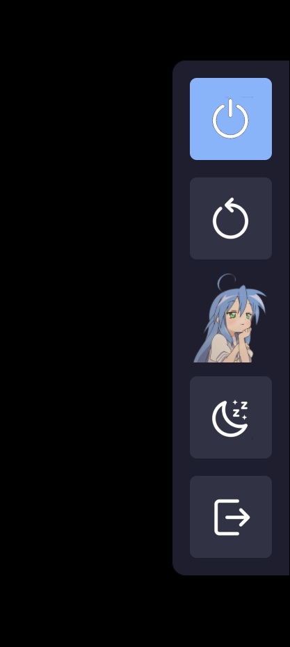

A minimalist and stylish power management menu for Wayland (Sway, Hyprland, etc.), built with Rust using Relm4 and GTK4.

# Features
    Layer Shell Integration: Sits perfectly on top of your windows using the gtk4-layer-shell protocol.

    Smooth Animations: Features a sleek sliding animation from the right side of the screen.

    Highly Customizable: Uses standard CSS for styling and external PNG/SVG files for icons.

    Lightweight: Built with Rust for minimal resource consumption and high performance.

# Dependencies

Before building, ensure you have the following system libraries installed:
### Arch Linux
``` Bash
sudo pacman -S base-devel gtk4 gtk4-layer-shell pkgconf rust
```

### Fedora
```Bash
sudo dnf install gtk4-devel gtk4-layer-shell-devel pkgconf-pkg-config
```

# Build & Installation

## 1. Script installation
Clone the repository:
``` Bash
git clone https://github.com/Hitoshi-hub/srsq-panel.git
cd srsq-panel
``` 

And just run script install.sh (outdated, you can just install it from packages)
``` Bash
./install.sh
```


This script will build it, and install in /usr/local/bin/

## 2. Manual installing

Clone the repository:
``` Bash
git clone https://github.com/Hitoshi-hub/srsq-panel.git
cd srsq-panel
``` 

Build the release version:
``` Bash
cargo build --release
```

Set up assets and binary:
The panel expects icons to be in your config directory. Run the following to set it up:
``` Bash
# Create config directory and copy assets
mkdir -p ~/.config/srsq-panel
cp assets/* ~/.config/srsq-panel/
# Move the binary to your local path
mkdir -p ~/.local/bin
cp target/release/srsq-panel ~/.local/bin/ # Or at /usr/local/bin 
```

Make it executable:
``` Bash
chmod +x ~/.local/bin/srsq-panel
```

Configuration

The panel looks for resources in ~/.config/srsq-panel/.
Required Assets:

    shutdown.png — Shutdown icon.

    reboot.png — Reboot icon.

    sleep.png — Suspend/Sleep icon.

    exit.png — Logout icon.

    background.png — The main center image/logo.

    style.css — Custom styles (automatically created with defaults if not found).

Integration (Sway/Hyprland)

Add the following to your Sway config file (~/.config/sway/config):

``` Bash
# Bind to a key combination (e.g., Mod + x)
bindsym $mod+x exec ~/.local/bin/srsq-panel # Or just srsq-panel, if it installed at /usr/local/bin
```

For Hyprland, add this to hyprland.conf:

``` Bash
bind = $mainMod, X, exec, ~/.local/bin/srsq-panel
```

# Screenshot




# License

MIT
